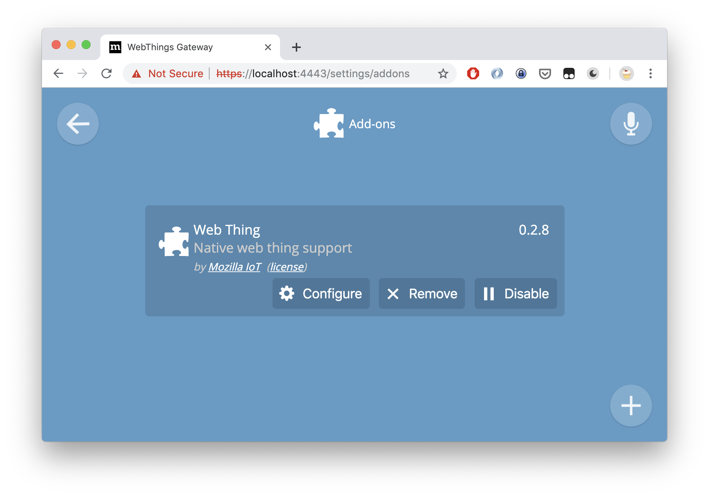
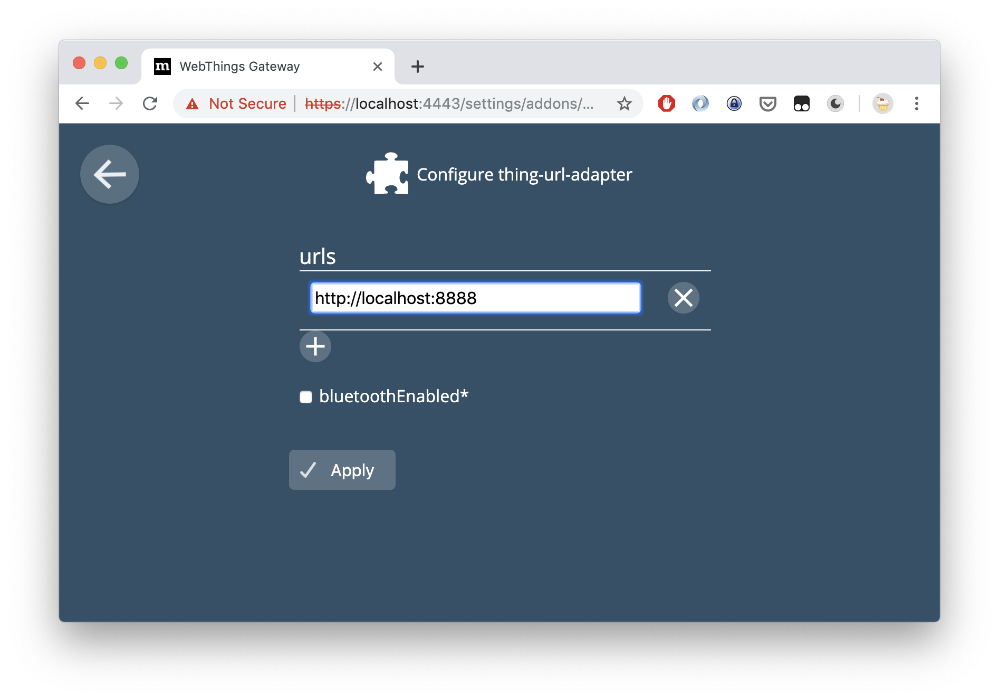
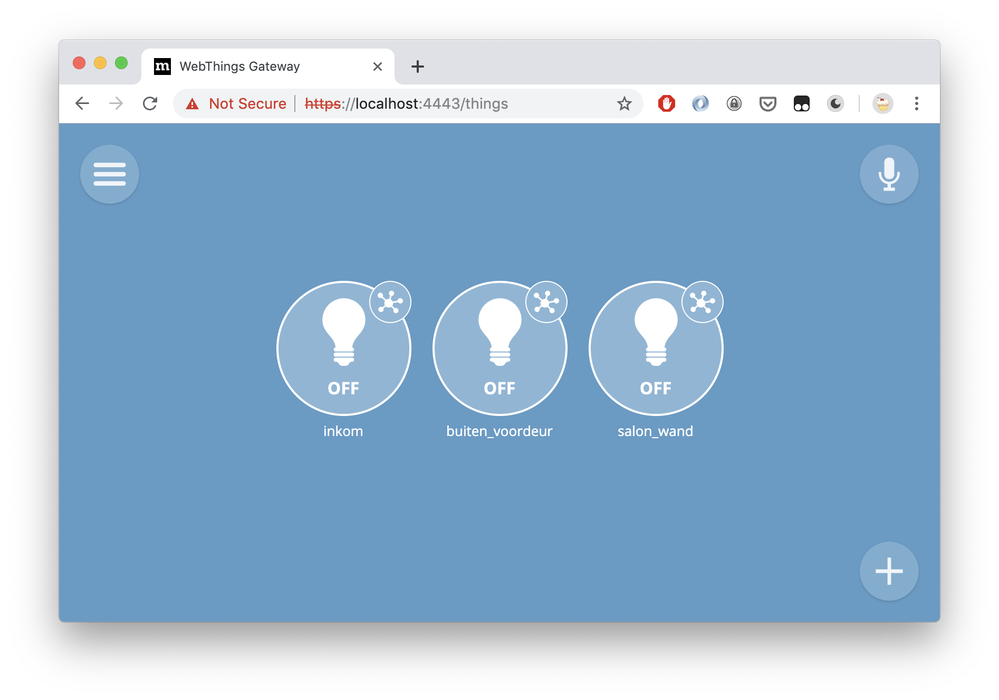

# Openwebnet-webthings

A [webthings](https://iot.mozilla.org/docs/) service for [openwebnet](https://www.myopen-legrandgroup.com/)

# Dependencies

This depends on the reopenwebnet python library. It can be installed like this:

    pip3 install reopenwebnet

# Usage

First edit the configuration file to describe your openwebnet-controlled devices.
There is an example in this directory: `openwebnet-webthings.example.yaml`

Next, start the webthings service:

    python openwebnet-webthings.py <your-config-file>

Finally, import the webthings into your iot gateway. The following screenshots document the process;
Depending on how you installed the iot gateway the process is more or less automatic.

